# Catalog and Matcher Database Model

This document defines the documentation-only conceptual persistence model for ArtCRM catalog, stock, import publication, Backend Catalog Matcher execution, analog rules, related component rules, delivery estimates, supplier quote requests/responses, pricing, discounts, and cart snapshots.

It does not add backend code, frontend code, SQL DDL, ORM models, migrations, FastAPI implementation, parser/import runner, price parser, email sending, API endpoints, UI, tests, pricing logic implementation, CP/invoice/PDF/1C flow, dependencies, containers, Ollama calls, model or Modelfile changes, `.env.example` changes, Excel files, real catalog rows, real stock rows, real prices, customer data, production emails, supplier emails, credentials, tokens, secrets, private keys, or filesystem model paths.

## Purpose

This document fixes a conceptual persistence model before backend implementation. It turns the catalog and matcher documentation chain from ART-36 through ART-39 into storage-oriented entities, relationships, lifecycle concepts, versioning rules, and audit expectations.

This document is:

- a conceptual persistence model;
- a design bridge before backend implementation;
- a reference for future database, import, matcher, delivery, supplier quote, price, and audit tasks;
- documentation-only.

This document is not:

- SQL schema;
- ORM model;
- migration;
- backend code;
- parser/import runner;
- price parser;
- email sending implementation;
- UI implementation;
- cart or CP price calculator implementation.

## Design Principles

- Catalog identity is stable and separate from stock.
- Stock changes daily and must be versioned and snapshotted.
- Stock import must not create product identity by itself.
- Source hierarchy must be preserved for audit and renormalization.
- Group/header rows are not SKU rows.
- `ProductTypeFilterProfile` controls applicable fields.
- `not_applicable` fields must not become required database filters.
- ROSMA has daily stock snapshots.
- Non-ROSMA manufacturers can be catalog-only with `unknown`, `manual`, or `quote_based` availability.
- Analogs are validated and versioned rules, not LLM inventions.
- Related components are validated and versioned compatibility rules, not Product Selector suggestions.
- Matcher executions are audit records, not catalog source of truth.
- Product Selector output is candidate data only.
- Delivery estimates are separate from exact supplier-confirmed delivery dates.
- Exact delivery confirmation from ROSMA is a supplier quote/response workflow, not Matcher source of truth.
- Price data is separate from catalog identity and stock.
- Customer price, purchase price, and manager manual discount must be separated.
- Product discount must not automatically apply to service positions unless a pricing rule explicitly allows it.
- Future customer and manager carts should display approximate delivery labels per item, for example `примерно 3–5 рабочих дней` or `примерно 2–3 недели`.
- The manager may request exact information from ROSMA through a future action: `Запросить точную информацию у РОСМА`.
- Supplier quote requests and supplier responses must be auditable and must not mutate base catalog identity.

## Conceptual Entity Groups

1. Source / Import layer: `source_file`, `import_source`, `source_hierarchy_node`.
2. Catalog identity layer: `manufacturer`, `product_family`, `product_type`, `catalog_publication`, `catalog_item`.
3. Parameter/profile layer: `product_type_filter_profile`, `catalog_item_parameter`.
4. Stock / availability layer: `stock_snapshot`, `stock_record`, `expected_receipt`.
5. Delivery estimate layer: `delivery_estimate_policy`, `cart_item_delivery_estimate`, `delivery_update_event`.
6. Supplier quote request / response layer: `supplier_quote_request`, `supplier_quote_request_item`, `supplier_quote_response`, `supplier_quote_response_item`.
7. Price layer: `price_source`, `catalog_item_price`.
8. Discount layer: `discount_rule`, `manager_item_discount`, `price_update_event`.
9. Cart item price/delivery snapshot layer: `cart_item_price_snapshot`, `cart_item_delivery_estimate`.
10. Analog layer: `analog_rule` / `analog_candidate`.
11. Related component layer: `related_component_rule`.
12. Matcher execution / audit layer: `matcher_execution`, `matcher_candidate`, `matcher_field_result`, `matcher_related_component_result`, `matcher_analog_result`, `matcher_validation_error`.
13. Publication / lifecycle layer: `audit_event`, `publication_event`, source/publication statuses.

## Entity: manufacturer

Purpose: identifies a manufacturer-specific catalog, import, stock, supplier quote, price, and rule boundary.

Conceptual fields:

- `manufacturer_id`;
- `manufacturer_code`;
- `display_name`;
- `source_profile`;
- `supports_daily_stock`;
- `supports_supplier_quote_request`;
- `default_availability_mode`;
- `status`;
- `created_at`;
- `updated_at`.

Rules:

- ROSMA has catalog plus daily stock mode.
- ROSMA supports supplier quote request workflow.
- Other manufacturers may be catalog-only.
- Manufacturer-specific mappings must not be universalized.
- Manufacturer settings may control default delivery and quote behavior, but not override product-type validation.

## Entity: source_file / import_source

Purpose: stores metadata and references for uploaded/imported source files without committing those files to the repository.

Conceptual fields:

- `source_file_id`;
- `source_type`: `catalog`, `stock`, `price`, `analog`, or `related_component_rules`;
- `manufacturer_id`;
- `file_name`;
- `file_hash`;
- `source_effective_date`;
- `uploaded_at`;
- `uploaded_by_ref`;
- `parser_profile_version`;
- `import_mode`: `manual`, `scheduled`, or `api`;
- `status`: `uploaded`, `parsed`, `normalized`, `validated`, `review_required`, `approved`, `published`, `rejected`, or `archived`;
- `source_metadata_json`.

Rules:

- Excel files are not committed to the repository.
- Raw source may be stored outside the database or in object storage later, but the database keeps metadata/reference.
- Source file is not source of truth for matcher directly.
- Price source is not catalog identity.
- Stock source is not catalog identity.
- The external price source filename may be referenced as metadata, for example `Артматика прайс (апрель 2026) с кодами(1).xls`, but real rows and real prices must not be committed to the repository.

## Entity: source_hierarchy_node

Purpose: preserves manufacturer source hierarchy, including group/header rows and item rows, for audit and renormalization.

Conceptual fields:

- `source_hierarchy_node_id`;
- `source_file_id`;
- `manufacturer_id`;
- `parent_node_id`;
- `source_hierarchy_path`;
- `parent_group_code`;
- `parent_group_name`;
- `top_group`;
- `source_row_kind`;
- `is_group`;
- `is_catalog_item`;
- `source_sheet_name`;
- `source_row_number`;
- `source_text`;
- `normalization_status`.

Rules:

- Group/header rows are not SKUs.
- Item rows can become catalog item candidates after validation.
- `source_hierarchy_path` must be preserved.
- Hierarchy can help derive product family/type hints, but it must not replace explicit product-type validation.

## Entity: product_family

Purpose: groups manufacturer-specific product families derived from catalog structure and normalized product taxonomy.

Conceptual fields:

- `product_family_id`;
- `manufacturer_id`;
- `family_code`;
- `display_name`;
- `source_group_name`;
- `normalized_group_name`;
- `source_hierarchy_node_id`;
- `status`.

Rules:

- Product family can be derived from source hierarchy but must be reviewable.
- Product family is not a sellable SKU by itself.

## Entity: product_type

Purpose: identifies the product type used by matching, profiles, pricing policies, delivery policies, and related-component compatibility.

Conceptual fields:

- `product_type_id`;
- `product_type_code`;
- `display_name`;
- `product_kind`;
- `manufacturer_scope`;
- `filter_profile_id`;
- `price_policy_id`;
- `delivery_estimate_policy_id`;
- `status`.

Allowed `product_kind` values:

- `group`;
- `main_product`;
- `accessory`;
- `service_position`;
- `spare_part`;
- `related_component_candidate`.

Rules:

- Do not use `instrument` as `product_kind`.
- Product type controls applicable parameters through `ProductTypeFilterProfile`.
- Service positions may have separate price and delivery behavior from main products.

## Entity: product_type_filter_profile

Purpose: defines which fields are required, optional, derived, or not applicable for a product type and manufacturer scope.

Conceptual fields:

- `filter_profile_id`;
- `product_type_id`;
- `manufacturer_id`;
- `profile_version`;
- `required_fields[]`;
- `optional_fields[]`;
- `derived_fields[]`;
- `not_applicable_fields[]`;
- `validation_rules_json`;
- `status`;
- `published_at`.

Rules:

- Required, optional, derived, and `not_applicable` fields must match `docs/CATALOG_MODEL.md`.
- `not_applicable` fields must not become required filters.
- Changes require profile versioning and audit.

## Entity: catalog_publication

Purpose: represents an approved, versioned catalog publication that matcher can use.

Conceptual fields:

- `catalog_publication_id`;
- `manufacturer_id`;
- `publication_version`;
- `source_file_id`;
- `status`: `draft`, `review_required`, `approved`, `published`, `archived`, or `rejected`;
- `published_at`;
- `published_by_ref`;
- `previous_publication_id`;
- `publication_notes`.

Rules:

- Matcher uses active/published catalog publication.
- Raw source files are not queried directly by matcher.
- Rollback can restore previous publication.
- Publication version is separate from source file version.

## Entity: catalog_item

Purpose: stable product identity used by matcher, stock, price, delivery, analogs, related components, and cart snapshots.

Conceptual fields:

- `catalog_item_id`;
- `catalog_publication_id`;
- `manufacturer_id`;
- `product_family_id`;
- `product_type_id`;
- `product_kind`;
- `series_code`;
- `model_code`;
- `article`;
- `sku`;
- `source_code`;
- `original_name`;
- `normalized_name`;
- `display_name`;
- `search_name`;
- `source_hierarchy_node_id`;
- `source_refs_json`;
- `default_delivery_estimate_policy_id`;
- `status`: `active`, `inactive`, `deprecated`, or `review_required`;
- `created_at`;
- `updated_at`.

Rules:

- `catalog_item` is stable product identity.
- `catalog_item` does not store daily stock as own fields.
- `catalog_item` does not store final matcher decisions.
- `catalog_item` does not store cart-specific manual discount.
- `catalog_item` can link to default price records and delivery estimate policy.
- Service positions can be catalog items, but pricing and discount behavior may differ from main products.

## Entity: catalog_item_parameter

Purpose: stores normalized product parameters in a product-type-aware way.

Conceptual fields:

- `catalog_item_parameter_id`;
- `catalog_item_id`;
- `product_type_id`;
- `parameter_code`;
- `applicability`: `required`, `optional`, `derived`, or `not_applicable`;
- `value_text`;
- `value_number`;
- `value_boolean`;
- `value_json`;
- `unit`;
- `normalized_value`;
- `source_text`;
- `normalization_status`;
- `confidence`;
- `status`.

Rules:

- Parameters exist only when applicable or useful for audit.
- `not_applicable` is not the same as missing.
- Missing required fields go to review.
- Parameter values must be profile-aware, not universal across all product types.

## Entity: stock_snapshot

Purpose: versioned availability snapshot, especially for ROSMA daily stock.

Conceptual fields:

- `stock_snapshot_id`;
- `manufacturer_id`;
- `source_file_id`;
- `snapshot_version`;
- `source_effective_date`;
- `status`: `imported`, `validated`, `review_required`, `published`, `archived`, or `rejected`;
- `published_at`;
- `published_by_ref`;
- `previous_snapshot_id`;
- `notes`.

Rules:

- ROSMA can have daily stock snapshots.
- Non-ROSMA may have no stock snapshot.
- Matcher uses latest published stock snapshot for ROSMA.
- Snapshot version is independent from catalog publication version.

## Entity: stock_record

Purpose: per-item, per-warehouse stock row in a stock snapshot.

Conceptual fields:

- `stock_record_id`;
- `stock_snapshot_id`;
- `catalog_item_id`;
- `source_code`;
- `warehouse_code`;
- `warehouse_name`;
- `available_qty`;
- `reserved_qty`;
- `availability_status`;
- `manual_check_required`;
- `source_row_number`;
- `source_reference_json`;
- `validation_status`.

Rules:

- `stock_record` must reference `catalog_item` when matched.
- If catalog item is missing, unresolved stock should be tracked separately or marked `review_required`.
- `stock_record` does not create catalog identity.
- `stock_record` may feed approximate delivery estimate, but does not replace supplier-confirmed delivery.

## Entity: expected_receipt

Purpose: future receipt information associated with a stock record.

Conceptual fields:

- `expected_receipt_id`;
- `stock_record_id`;
- `expected_date`;
- `expected_qty`;
- `source_column`;
- `source_reference_json`;
- `status`.

Rules:

- Expected receipts are part of stock/availability context.
- Expected receipts can feed approximate delivery labels but are not exact supplier confirmation.

## Entity: delivery_estimate_policy

Purpose: maps stock/availability and product context to approximate customer/manager delivery labels.

Conceptual fields:

- `delivery_estimate_policy_id`;
- `manufacturer_id`;
- `product_type_id`;
- `availability_status`;
- `stock_condition`;
- `customer_label`;
- `manager_label`;
- `estimate_min_business_days`;
- `estimate_max_business_days`;
- `estimate_type`: `stock_based`, `expected_receipt_based`, `supplier_quote_based`, `manual`, or `unknown`;
- `rule_version`;
- `status`.

Examples:

- in stock -> `примерно 3–5 рабочих дней`;
- expected / not in stock -> `примерно 2–3 недели`;
- quote-based -> `срок уточняется у поставщика`.

Rules:

- Delivery estimate is approximate.
- Customer sees simplified label.
- Manager sees label and supplier quote request action when applicable.
- Exact supplier-confirmed dates are stored separately.
- The future manager action label is `Запросить точную информацию у РОСМА`.

## Entity: cart_item_delivery_estimate

Purpose: stores a delivery estimate snapshot for a cart/request/offer item.

Conceptual fields:

- `cart_item_delivery_estimate_id`;
- `cart_item_ref`;
- `catalog_item_id`;
- `stock_snapshot_id`;
- `stock_record_id`;
- `delivery_estimate_policy_id`;
- `customer_delivery_label`;
- `manager_delivery_label`;
- `estimate_min_business_days`;
- `estimate_max_business_days`;
- `estimate_source`: `stock`, `expected_receipt`, `supplier_quote`, `manual`, or `unknown`;
- `supplier_confirmed_delivery_date`;
- `supplier_confirmed_delivery_label`;
- `last_updated_by_ref`;
- `last_updated_at`;
- `source_ref`;
- `status`.

Rules:

- This is a snapshot for cart/offer workflow.
- It can differ from default policy after supplier response.
- Old and new values must be auditable.
- Cart delivery snapshot must not mutate catalog identity or stock snapshot.

## Entity: supplier_quote_request

Purpose: represents a future request for exact ROSMA information, such as delivery timing, price, availability, or conditions.

Conceptual fields:

- `supplier_quote_request_id`;
- `manufacturer_id`;
- `supplier_contact_ref`;
- `request_card_ref`;
- `cart_ref`;
- `status`: `draft`, `sent`, `waiting_response`, `answered`, `closed`, or `canceled`;
- `draft_subject`;
- `draft_body`;
- `created_by_ref`;
- `created_at`;
- `sent_at`;
- `source_action`: `manager_request_exact_info`;
- `notes`.

Rules:

- This task only documents the model.
- Do not implement email sending.
- Do not implement Gmail/SMTP integration.
- Draft email can be generated in future from cart/request items.
- Supplier quote request is separate from matcher execution and catalog identity.

Future draft body template with placeholders only:

```text
Добрый день!

Запрашиваем КП на следующие позиции:

1) артикул / полное наименование товара / количество
2) при наличии дополнений: гидрозаполнение, сборка, аксессуары, другие связанные позиции / количество
```

## Entity: supplier_quote_request_item

Purpose: item-level payload included in a supplier quote request.

Conceptual fields:

- `supplier_quote_request_item_id`;
- `supplier_quote_request_id`;
- `cart_item_ref`;
- `request_position_ref`;
- `catalog_item_id`;
- `article`;
- `sku`;
- `full_name`;
- `quantity`;
- `unit`;
- `parent_item_ref`;
- `related_component_type`;
- `service_type`;
- `notes`.

Rules:

- Main products and related service positions can both be included.
- Hydrofilling and special services should be represented as separate request items or related components.
- Supplier quote request item must not create catalog identity.

## Entity: supplier_quote_response

Purpose: stores metadata and summary for a supplier response.

Conceptual fields:

- `supplier_quote_response_id`;
- `supplier_quote_request_id`;
- `manufacturer_id`;
- `received_at`;
- `received_by_ref`;
- `source_email_ref`;
- `status`: `received`, `parsed`, `review_required`, `applied`, or `archived`;
- `response_summary`;
- `notes`.

Rules:

- Response may update delivery estimate, price, availability, or conditions.
- Response is not automatically trusted without review unless future policy allows it.
- Store a reference to the supplier response, not production supplier emails in repository docs.

## Entity: supplier_quote_response_item

Purpose: item-level supplier response details that can update cart delivery/price snapshots after review.

Conceptual fields:

- `supplier_quote_response_item_id`;
- `supplier_quote_response_id`;
- `supplier_quote_request_item_id`;
- `catalog_item_id`;
- `confirmed_available_qty`;
- `confirmed_delivery_date`;
- `confirmed_delivery_label`;
- `confirmed_supplier_price`;
- `confirmed_discount`;
- `confirmed_purchase_price`;
- `currency`;
- `vat_included`;
- `manager_review_required`;
- `applied_to_cart_item_ref`;
- `status`.

Rules:

- Confirmed delivery may override approximate estimate for cart/manager workflow.
- Confirmed prices are source-specific and must be auditable.
- Supplier response does not mutate base catalog identity.

## Entity: price_source / price_list_source

Purpose: versioned source for price data, separate from catalog identity and stock.

Conceptual fields:

- `price_source_id`;
- `manufacturer_id`;
- `source_file_id`;
- `price_source_type`: `supplier_price_list`, `manual_price_update`, or `supplier_quote_response`;
- `source_effective_date`;
- `currency`;
- `vat_policy`;
- `status`: `uploaded`, `parsed`, `normalized`, `validated`, `review_required`, `approved`, `published`, `archived`, or `rejected`;
- `price_source_version`;
- `notes`.

Rules:

- Uploaded Excel file is not committed to repository.
- Price source is versioned.
- Price source is separate from catalog identity.
- The external source may contain business fields such as `Цена с НДС`, supplier discount, and `Цена со скидкой`, but real rows and real prices must not be stored in repository docs.

## Entity: catalog_item_price

Purpose: stores versioned price values for a catalog item from an approved price source.

Conceptual fields:

- `catalog_item_price_id`;
- `catalog_item_id`;
- `price_source_id`;
- `customer_price_with_vat`;
- `supplier_discount_percent`;
- `purchase_price_after_discount`;
- `currency`;
- `vat_rate`;
- `vat_included`;
- `effective_from`;
- `effective_to`;
- `status`: `draft`, `active`, `archived`, or `rejected`;
- `source_ref`;
- `notes`.

Mapping:

- `Цена с НДС` -> `customer_price_with_vat`;
- supplier discount from ROSMA -> `supplier_discount_percent`;
- `Цена со скидкой` -> `purchase_price_after_discount`.

Rules:

- Do not add real price rows.
- Prices are source/version based.
- Price records can be replaced by newer published price source.
- Price records must not store manager-specific manual discount.

## Entity: discount_rule

Purpose: defines when manual discounts are allowed and whether they may apply to services.

Conceptual fields:

- `discount_rule_id`;
- `manufacturer_id`;
- `product_type_id`;
- `product_kind`;
- `rule_name`;
- `discount_allowed`;
- `applies_to_services`;
- `max_discount_percent`;
- `requires_manager_reason`;
- `rule_version`;
- `status`.

Rules:

- Product items can allow manager manual discount.
- Service positions should not receive product discount by default.
- Service discount requires an explicit rule.
- Manager discount rules must be auditable and versioned.

## Entity: manager_item_discount

Purpose: stores manager-entered manual discount per item.

Conceptual fields:

- `manager_item_discount_id`;
- `cart_item_ref`;
- `request_position_ref`;
- `catalog_item_id`;
- `discount_percent`;
- `discount_amount`;
- `reason`;
- `applied_by_ref`;
- `applied_at`;
- `status`: `active`, `replaced`, or `canceled`;
- `audit_ref`.

Rules:

- Manual discount is per item.
- Manual discount must be auditable.
- Manual discount does not mutate `catalog_item_price`.
- Product discount must not automatically apply to service positions unless `discount_rule.applies_to_services` allows it.

## Entity: cart_item_price_snapshot

Purpose: preserves item price values at the moment of cart/offer workflow.

Conceptual fields:

- `cart_item_price_snapshot_id`;
- `cart_item_ref`;
- `request_position_ref`;
- `catalog_item_id`;
- `catalog_item_price_id`;
- `quantity`;
- `customer_price_with_vat`;
- `purchase_price_after_discount`;
- `manager_discount_percent`;
- `manager_discount_amount`;
- `final_customer_unit_price`;
- `final_customer_total_price`;
- `currency`;
- `vat_rate`;
- `vat_included`;
- `price_source_id`;
- `calculated_at`;
- `calculated_by_ref`;
- `status`.

Rules:

- Snapshot preserves price at the moment of cart/offer workflow.
- Recalculation creates a new snapshot or audit event.
- Product item discount and service item pricing must remain separate.
- This document does not define or implement the price calculation algorithm.

## Entity: price_update_event / price_audit_event

Purpose: audit trail for price and manual discount changes.

Conceptual fields:

- `price_update_event_id`;
- `entity_type`;
- `entity_id`;
- `previous_value_json`;
- `new_value_json`;
- `reason`;
- `actor_ref`;
- `event_at`;
- `source_ref`;
- `notes`.

Rules:

- Manual discount changes must be auditable.
- Supplier quote response price updates must be auditable.
- Price import publication must be auditable.
- Audit events must not expose secrets or production emails.

## Entity: delivery_update_event

Purpose: audit trail for delivery estimate/date changes.

Conceptual fields:

- `delivery_update_event_id`;
- `entity_type`;
- `entity_id`;
- `previous_delivery_label`;
- `new_delivery_label`;
- `previous_delivery_date`;
- `new_delivery_date`;
- `source`: `stock_snapshot`, `supplier_quote_response`, or `manager_manual_update`;
- `actor_ref`;
- `event_at`;
- `source_ref`;
- `notes`.

Rules:

- If ROSMA changes delivery information, old and new estimates must be preserved.
- Manager manual changes require audit.
- Supplier response reference should be stored through `source_ref`.

## Entity: analog_rule / analog_candidate

Purpose: stores validated analog relationships or candidates from reviewed analog sources.

Conceptual fields:

- `analog_rule_id`;
- `manufacturer_id`;
- `source_catalog_item_id`;
- `target_catalog_item_id`;
- `source_constraints_json`;
- `target_constraints_json`;
- `matched_fields[]`;
- `forbidden_mismatch[]`;
- `validation_status`;
- `rule_version`;
- `source_file_id`;
- `status`: `draft`, `review_required`, `approved`, `published`, `archived`, or `rejected`.

Rules:

- Analogs are not LLM inventions.
- Analogs require validation/publication.
- ART-35 remains separate task for real analog reference content.
- Analog rules do not mutate catalog item identity.

## Entity: related_component_rule

Purpose: stores backend-reviewed compatibility knowledge for related components and service positions.

Conceptual fields:

- `related_component_rule_id`;
- `manufacturer_id`;
- `parent_product_type_id`;
- `child_product_type_id`;
- `parent_series_code`;
- `child_series_code`;
- `relation_type`;
- `compatibility_rules_json`;
- `quantity_policy`;
- `required_parent_fields[]`;
- `duplicate_suppression_rule`;
- `rule_version`;
- `validation_status`;
- `source_file_id`;
- `status`.

Rules:

- Product Selector suggestions are candidate data only.
- `related_component_rule` is backend-reviewed compatibility knowledge.
- Hydrofilling and thermowell compatibility must be rule-driven.
- Duplicate suppression should be captured as a rule, not ad hoc UI behavior.

## Entity: matcher_execution

Purpose: audit record for a matcher request and decision.

Conceptual fields:

- `matcher_execution_id`;
- `matcher_request_id`;
- `idempotency_key`;
- `request_position_ref`;
- `request_card_ref`;
- `agent_run_ref`;
- `product_selector_output_ref`;
- `schema_version`;
- `matcher_version`;
- `manufacturer_id`;
- `product_type_id`;
- `product_kind`;
- `catalog_publication_id`;
- `stock_snapshot_id`;
- `decision`;
- `decision_reason`;
- `decision_severity`;
- `selected_catalog_item_id`;
- `confidence`;
- `manager_message`;
- `next_action`;
- `requested_at`;
- `completed_at`;
- `status`.

Rules:

- `matcher_execution` is an audit record.
- `matcher_execution` is not catalog source of truth.
- Same `idempotency_key` should prevent duplicate executions for the same context.
- Matcher output must not store raw prompts, secrets, or raw Excel as source of truth.

## Entity: matcher_candidate

Purpose: records candidates evaluated during matcher execution.

Conceptual fields:

- `matcher_candidate_id`;
- `matcher_execution_id`;
- `catalog_item_id`;
- `rank`;
- `candidate_source`: `exact_lookup`, `parameter_lookup`, `search_variant`, `analog_layer`, or `related_rule`;
- `score_candidate`;
- `rejected`;
- `rejection_reason`;
- `blocked_by_field`;
- `explanation_json`.

## Entity: matcher_field_result

Purpose: records field-level matcher validation results.

Conceptual fields:

- `matcher_field_result_id`;
- `matcher_execution_id`;
- `field_code`;
- `expected_value`;
- `actual_value`;
- `unit`;
- `match_status`: `matched`, `mismatched`, `missing`, `ignored_not_applicable`, `derived`, or `optional_missing`;
- `critical`;
- `blocker`;
- `message`.

Rules:

- `ignored_not_applicable` must be explicit for audit.
- Critical blockers must explain why automatic matching is blocked.

## Entity: matcher_related_component_result

Purpose: stores matcher validation output for candidate related components.

Conceptual fields:

- `matcher_related_component_result_id`;
- `matcher_execution_id`;
- `related_component_rule_id`;
- `parent_position_ref`;
- `relation_type`;
- `decision`: `accepted_candidate`, `needs_review`, `blocked`, `duplicate_suppressed`, or `not_requested`;
- `selected_catalog_item_id`;
- `quantity`;
- `compatibility_status`;
- `duplicate_status`;
- `manager_message`;
- `validation_errors_json`.

## Entity: matcher_analog_result

Purpose: stores matcher analog lookup result for audit.

Conceptual fields:

- `matcher_analog_result_id`;
- `matcher_execution_id`;
- `analog_rule_id`;
- `decision`: `not_requested`, `unavailable`, `candidate_found`, `blocked`, or `needs_review`;
- `analog_catalog_item_id`;
- `source_catalog_item_id`;
- `validation_required`;
- `customer_confirmation_required`;
- `manager_message`.

## Entity: matcher_validation_error

Purpose: stores validation errors produced by matcher.

Conceptual fields:

- `matcher_validation_error_id`;
- `matcher_execution_id`;
- `error_code`;
- `error_message`;
- `error_severity`;
- `field_code`;
- `details_json`;
- `source_ref`;
- `retryable`;
- `manager_action`.

Rules:

- Error summaries must be safe and must not expose secrets, raw prompts, or production emails.

## Entity: audit_event / publication_event

Purpose: generic event log for status transitions, publication, rollback, manual changes, and review decisions.

Conceptual fields:

- `event_id`;
- `entity_type`;
- `entity_id`;
- `event_type`;
- `previous_status`;
- `new_status`;
- `actor_ref`;
- `event_at`;
- `source_ref`;
- `notes`;
- `diff_json`.

Rules:

- Publication and rollback must be auditable.
- Manual discount and delivery changes must be auditable.
- Audit event payloads must avoid secrets, tokens, raw prompts, and full production email bodies.

## Relationships

Conceptual ER diagram:

```mermaid
erDiagram
  MANUFACTURER ||--o{ SOURCE_FILE : provides
  MANUFACTURER ||--o{ PRODUCT_FAMILY : owns
  MANUFACTURER ||--o{ PRODUCT_TYPE : defines
  MANUFACTURER ||--o{ CATALOG_PUBLICATION : publishes
  MANUFACTURER ||--o{ STOCK_SNAPSHOT : snapshots
  MANUFACTURER ||--o{ PRICE_SOURCE : prices
  MANUFACTURER ||--o{ SUPPLIER_QUOTE_REQUEST : receives
  SOURCE_FILE ||--o{ SOURCE_HIERARCHY_NODE : contains
  SOURCE_FILE ||--o{ CATALOG_PUBLICATION : feeds
  SOURCE_FILE ||--o{ STOCK_SNAPSHOT : feeds
  SOURCE_FILE ||--o{ PRICE_SOURCE : feeds
  SOURCE_HIERARCHY_NODE ||--o{ PRODUCT_FAMILY : derives
  SOURCE_HIERARCHY_NODE ||--o{ CATALOG_ITEM : traces
  PRODUCT_FAMILY ||--o{ CATALOG_ITEM : groups
  PRODUCT_TYPE ||--o{ PRODUCT_TYPE_FILTER_PROFILE : profiles
  PRODUCT_TYPE ||--o{ CATALOG_ITEM : classifies
  PRODUCT_TYPE ||--o{ DELIVERY_ESTIMATE_POLICY : estimates
  PRODUCT_TYPE ||--o{ DISCOUNT_RULE : discounts
  CATALOG_PUBLICATION ||--o{ CATALOG_ITEM : contains
  CATALOG_ITEM ||--o{ CATALOG_ITEM_PARAMETER : has
  CATALOG_ITEM ||--o{ STOCK_RECORD : stock_for
  CATALOG_ITEM ||--o{ CATALOG_ITEM_PRICE : priced_by
  CATALOG_ITEM ||--o{ CART_ITEM_PRICE_SNAPSHOT : priced_in_cart
  CATALOG_ITEM ||--o{ CART_ITEM_DELIVERY_ESTIMATE : delivery_in_cart
  STOCK_SNAPSHOT ||--o{ STOCK_RECORD : contains
  STOCK_RECORD ||--o{ EXPECTED_RECEIPT : has
  DELIVERY_ESTIMATE_POLICY ||--o{ CART_ITEM_DELIVERY_ESTIMATE : applies
  PRICE_SOURCE ||--o{ CATALOG_ITEM_PRICE : provides
  CATALOG_ITEM_PRICE ||--o{ CART_ITEM_PRICE_SNAPSHOT : snapshots
  DISCOUNT_RULE ||--o{ MANAGER_ITEM_DISCOUNT : governs
  MANAGER_ITEM_DISCOUNT ||--o{ CART_ITEM_PRICE_SNAPSHOT : affects
  SUPPLIER_QUOTE_REQUEST ||--o{ SUPPLIER_QUOTE_REQUEST_ITEM : contains
  SUPPLIER_QUOTE_REQUEST ||--o{ SUPPLIER_QUOTE_RESPONSE : receives
  SUPPLIER_QUOTE_RESPONSE ||--o{ SUPPLIER_QUOTE_RESPONSE_ITEM : contains
  SUPPLIER_QUOTE_RESPONSE_ITEM ||--o{ CART_ITEM_DELIVERY_ESTIMATE : may_update
  SUPPLIER_QUOTE_RESPONSE_ITEM ||--o{ CART_ITEM_PRICE_SNAPSHOT : may_update
  CATALOG_ITEM ||--o{ ANALOG_RULE : source_or_target
  CATALOG_ITEM ||--o{ RELATED_COMPONENT_RULE : parent_or_child
  MATCHER_EXECUTION ||--o{ MATCHER_CANDIDATE : evaluates
  MATCHER_EXECUTION ||--o{ MATCHER_FIELD_RESULT : records
  MATCHER_EXECUTION ||--o{ MATCHER_RELATED_COMPONENT_RESULT : validates
  MATCHER_EXECUTION ||--o{ MATCHER_ANALOG_RESULT : checks
  MATCHER_EXECUTION ||--o{ MATCHER_VALIDATION_ERROR : has
  AUDIT_EVENT ||--o{ PUBLICATION_EVENT : includes
```



Relationship rules:

- `manufacturer` owns product families, product types, catalog publications, stock snapshots, price sources, and supplier quote workflows.
- `source_file` feeds source hierarchy, catalog publications, stock snapshots, price sources, analog rules, and related component rules.
- `product_type` points to `ProductTypeFilterProfile` and governs applicable fields.
- `catalog_publication` contains catalog items.
- `catalog_item` has parameters, stock records, price records, cart snapshots, analog links, and related component rules.
- `stock_snapshot` contains stock records; stock records may have expected receipts.
- `matcher_execution` references request position, AgentRun, Product Selector output, catalog publication, stock snapshot, candidates, field results, related component results, analog result, and validation errors.
- `supplier_quote_response_item` can update cart delivery or price snapshots after review without mutating catalog identity.

## Lifecycle and statuses

Source/import statuses:

- `uploaded`;
- `parsed`;
- `normalized`;
- `validated`;
- `review_required`;
- `approved`;
- `published`;
- `rejected`;
- `archived`.

Publication statuses:

- `draft`;
- `review_required`;
- `approved`;
- `published`;
- `archived`;
- `rejected`.

Catalog item statuses:

- `active`;
- `inactive`;
- `deprecated`;
- `review_required`.

Stock snapshot statuses:

- `imported`;
- `validated`;
- `review_required`;
- `published`;
- `archived`;
- `rejected`.

Price source statuses:

- `uploaded`;
- `parsed`;
- `normalized`;
- `validated`;
- `review_required`;
- `approved`;
- `published`;
- `archived`;
- `rejected`.

Supplier quote statuses:

- request: `draft`, `sent`, `waiting_response`, `answered`, `closed`, `canceled`;
- response: `received`, `parsed`, `review_required`, `applied`, `archived`.

Rule statuses:

- `draft`;
- `review_required`;
- `approved`;
- `published`;
- `archived`;
- `rejected`;
- `active`;
- `inactive`.

Matcher execution statuses:

- `queued`;
- `running`;
- `completed`;
- `failed`;
- `needs_review`;
- `blocked`;
- `canceled`.

## Versioning

Versioned references:

- `source_file` hash, version, and effective date;
- `catalog_publication_version`;
- `stock_snapshot_version`;
- `price_source_version`;
- `product_type_filter_profile_version`;
- `analog_rule_version`;
- `related_component_rule_version`;
- `matcher_version`;
- `schema_version`.

Rules:

- Catalog publication version and stock snapshot version are independent.
- Price source version is independent from catalog identity.
- Delivery and price cart snapshots keep the version refs used when they were created.
- Matcher execution stores catalog, stock, profile, schema, and matcher versions for audit.
- Rule changes must create new versions rather than silently mutating historical decisions.

## Conceptual Search/Indexing Considerations

These are conceptual lookup needs only. Do not add actual SQL indexes in this task.

- Lookup catalog item by manufacturer + product type + normalized name.
- Lookup catalog item by source code, SKU, or article.
- Lookup catalog item parameters by product type + parameter code + normalized value + unit.
- Lookup latest published catalog publication per manufacturer.
- Lookup latest published stock snapshot per manufacturer.
- Lookup latest published price source per manufacturer.
- Lookup stock by catalog item + warehouse.
- Lookup price by catalog item + active price source.
- Lookup delivery estimate by catalog item + stock status + delivery policy.
- Lookup supplier quote request by cart, request, and manager action.
- Lookup matcher audit by `request_position_ref`, `agent_run_ref`, `product_selector_output_ref`, or `idempotency_key`.
- Lookup manual discount audit by cart item, request position, catalog item, actor, and event time.
- Lookup delivery changes by cart item, supplier quote response item, and delivery update event.

## Data Safety

Rules:

- No secrets.
- No tokens.
- No raw prompts.
- No local filesystem model paths.
- No real Excel data in repository.
- No real prices or customer data in repository.
- No production emails or supplier emails in repository.
- Source files should be stored as metadata/reference in this conceptual model.
- Matcher tables do not store raw Excel as source of truth.
- Supplier quote response references must avoid embedding full sensitive email bodies unless a future secure storage policy allows it.
- Audit summaries must be safe for review and must not leak credentials or private keys.

## Deferred Implementation

Deferred work:

- SQL DDL;
- ORM models;
- DB migrations;
- FastAPI implementation;
- parser/import runner;
- price Excel parser;
- admin UI;
- cart UI;
- manager button implementation;
- email sending;
- Gmail/SMTP integration;
- supplier quote workflow code;
- price calculator code;
- background jobs;
- scheduler;
- tests;
- pricing engine;
- CP/invoice/PDF;
- 1C exchange;
- real analog reference import;
- real stock import code;
- real price import code;
- exact storage technology;
- retention policy for source files and supplier responses.
